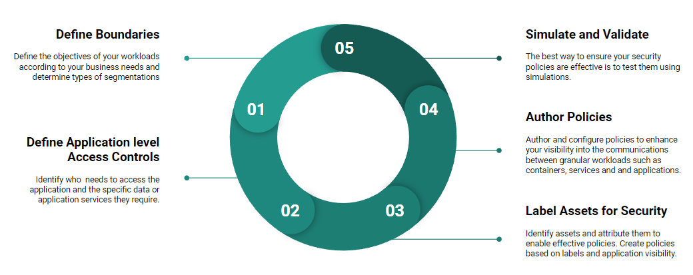
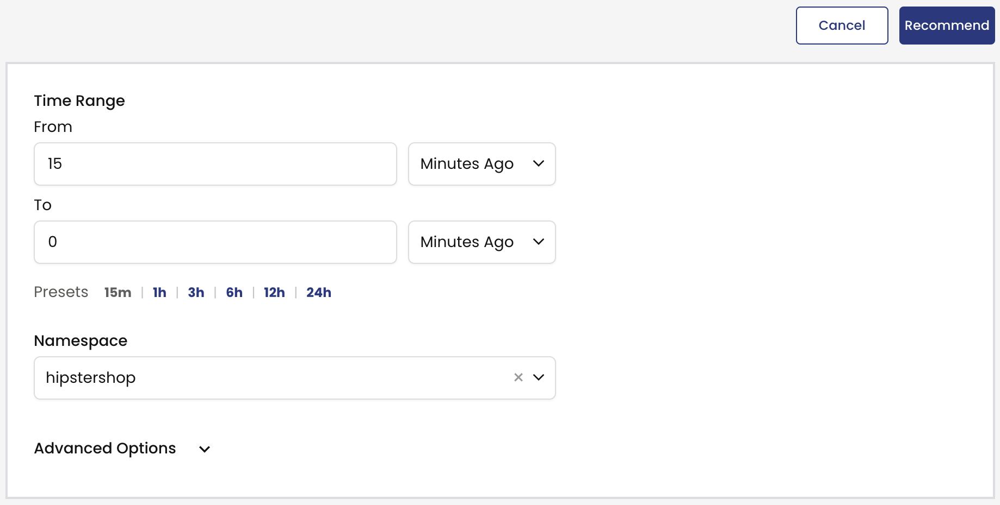
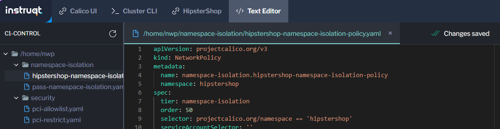
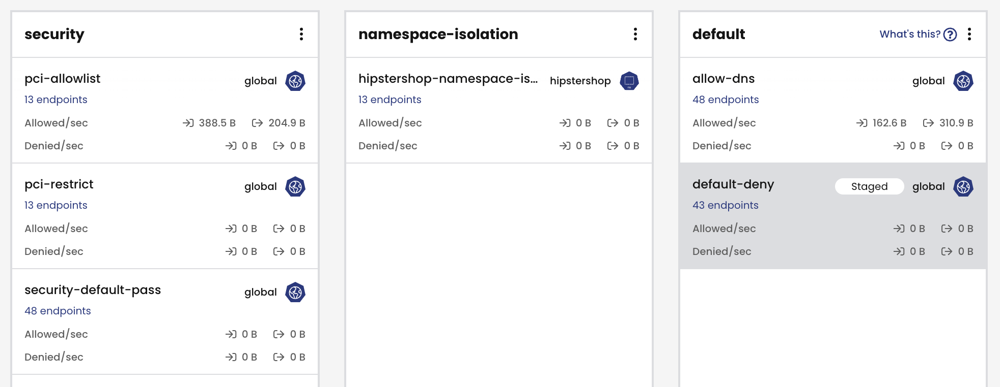

Microsegmentation
==============

Lets start applying some policies.

## Step 1 - Create Policy Tiers

💡 *Tiers* are a hierarchical construct used to group policies and enforce higher precedence policies that cannot be circumvented by other teams.

Next, determine the priority of policies in tiers (from top to bottom). Tiers are ordered from left to right, starting with the highest priority tiers. Policies are processed in sequential order from top to bottom.

In the following example,  "platform" and "security" tiers use Calico's global network policies that apply to all pods, while developer teams can safely manage pods within namespaces for their applications and microservices using "app-hipstershop" tier

For this workshop, create 3 tiers in the cluster and utilize the default tier as well:

**security** - Global security tier with controls such as PCI restrictions.

**platform** - Platform level controls such as DNS policy and tenant level isolation.

**app-hipster** - Application specific tier for microsegmentation inside the application.

To create the tiers apply the following manifest:

```yaml
kubectl apply -f -<<EOF
apiVersion: projectcalico.org/v3
kind: Tier
metadata:
  name: app-hipstershop
spec:
  order: 400
---
apiVersion: projectcalico.org/v3
kind: Tier
metadata:
  name: platform
spec:
  order: 300
---
apiVersion: projectcalico.org/v3
kind: Tier
metadata:
  name: security
spec:
  order: 200
EOF
```

Now go to Calico Cloud and check the created tiers under `policies` page


## Step 3 - Configure Global Policies

💡*Global* Network policies is not a namespaced resource, it applies to the whole cluster.

After creating tiers, apply some general global policies to them before creating application specific policies. These policies include allowing traffic to kube-dns from all pods, passing traffic that doesn't explicitly match in the tier and finally a default deny policy.

# Segmentation for Namespace Isolation

In this module we will be following the best practice steps for implementing microsegmentation to secure and isolate namespaces.

In large clusters where there are multiple namespaces, applications, or teams using the infrastructure it would be best practice to enable namespace isolation to protect from misconfigurations or malicious activity.

Isolating the hipstershop namespace will be very similar to the previous module, except instead of using the 'pci=true' label selector, we will be using a namespace selector.

If you need a reminder, we will approach microsegmentation by following these 5 steps:




1. Define Boundaries
================

The boundary for this isolation is straightforward - the hipstershop namespace.


2. Define Application Level Access Controls
================

We can allow traffic within the hipstershop namespace to communicate with itself.
However, as this is an online storefront, end-users (clients) must be able to access the frontend in order to browse and purchase items. Therefore, we must allow some traffic into the namespace.

The hipstershop namespace will need to allow egress traffic to the public internet and kube-dns.

Another consideration we need to make is who in the organization will be managing these policies, and how might they come into play with any other policies that are applied to the cluster.

Now would be a good time to consider Policy Tiers.
Remember, these are a hierarchical grouping of policies within Calico. In the previous module we applied policies in the 'security' tier.

Namespace isolation policies will use the 'namespace-isolation' tier.

When authoring the policy for namespace isolation, we should ensure:
* entities that are within the hipstershop namespace can talk to each other
* other entities within the cluster cannot talk to hipstershop services, except:
* public access should be permitted to the frontend of the application
* namespace isolation policy should exist in the namespace-isolation tier
* any necessary egress traffic is allowed


1. Labelling Assets
================
For this scenario we can use a network policy, which is namespace scoped, rather than a global policy. This policy will only target pods inside the hipstershop namespace.

For this reason, assets within the namespace do not need to be labelled.

However, for any ingress or egress communication it may be necessary to label those assets, or find out what existing labels exist.

In this scenario no labels need to be created because the namespace will be specified within the metadata of the policy:
``` yaml,nocopy
apiVersion: projectcalico.org/v3
kind: NetworkPolicy
metadata:
  name: hipstershop-policy
  namespace: hipstershop
```

4. Author Policies
================

# 1. Review the namespace isolation tier
   Before authoring any policies we need to ensure the namespace isolation policy tier exists.
   You already created the namespace isolation policy tier in a previous module. It should be visible on the policy board and occur after the 'security' and 'platform' tiers.

   The namespace isolation tier contains any policies that isolate namespaces.

# 2. Generate a recommended policy for the hipstershop
   In the ```Calico UI``` tab, find the ```Policies``` menu option on the left hand side.

   At the top-right of the policies board you should see a ```Recommend a Policy``` button.
   Click this button, and choose the hipstershop namespace. Press ```Recommend```.

   

   > [!WARNING]
   > If you get the message: "The recommendation engine did not find any flows that requires a new policy. Please try a different namespace or workload." You can apply this policy through the CLI /home/nwp/namespace-isolation/hipstershop-namespace-isolation-policy.yaml.

# 3. Review the recommended policy
   The generated policy will be based on traffic within the hipstershop namespace in the last 15 minutes (default time interval).

   Verify the policy:
   * Is named hipstershop-namespace-isolation-policy
   * Has the scope set to namespace and hipstershop is selected.
   * Has both ingress and egress rules to allow the correct communication within and outside of the namespace

   > [!NOTE]
   > If you're not sure what traffic is occuring over a specific port, use the Dynamic Service and Threat Graph or Flow Logs to find out.

   The equivalent yaml manifest of the recommeded policy can be found in the ```Text Editor``` tab in the ```namespace-isolation``` folder.

   

# 4. Enforce the recommended policy

   Click 'Enforce' on the top right of the screen.

# 5. Check the Policy Board

   The new policy will be showing at the bottom of the default tier.

   Click and drag the policy to move it to the 'namespace-isolation' tier.

   

# 6. Add a pass policy for the namespace-isolation tier

   Add a pass policy for the namespace-isolation tier:

```bash
kubectl apply -f - <<EOF
apiVersion: projectcalico.org/v3
kind: GlobalNetworkPolicy
metadata:
  name: namespace-isolation.namespace-isolation-default-pass
spec:
  tier: namespace-isolation
  order: 150
  selector: ""
  namespaceSelector: ""
  serviceAccountSelector: ""
  ingress:
    - action: Pass
      source: {}
      destination: {}
  egress:
    - action: Pass
      source: {}
      destination: {}
  doNotTrack: false
  applyOnForward: false
  preDNAT: false
  types:
    - Ingress
    - Egress
EOF
```

   This passes any traffic that isn't matched in this tier to further tiers for evaluation.

Simulate and Validate
================

To test the effectiveness of the namespace isolation policy we can run two tests:
* Test the connectivity from pods within the hipstershop namespace
* Test the connectivity from pods outside the hipstershop namespace

# 1. Test connectivity from a pod *within* the hipstershop namespace
   Inside the hipstershop namespace is a pod named ```multitool```. This pod is not part of the hipstershop application; it's purpose is for testing policies.

   The multitool pod has curl and netcat installed to test communications.

   Try connecting to the cart service from the multitool pod:

   ```bash
   kubectl -n hipstershop exec -t multitool -- sh -c 'nc -zvw 3 cartservice.hipstershop 7070'
   ```

   The test should work, because both source (```multitool```) and destination (```cartservice```) are within the hipstershop namespace.

   ```bash,nocopy
   cartservice.hipstershop (10.43.194.201:7070) open
   ```

   Try connecting to the frontend from the multitool pod:

   ```bash
   kubectl -n hipstershop exec -t multitool -- sh -c 'curl -I frontend.hipstershop 2>/dev/null | grep -i http'
   ```
   The test should work, because both source (```multitool```) and destination (```frontend```) are within the hipstershop namespace. Additionally, we allowed ingress traffic to the namespace on port 8080.

   ```bash,nocopy
   HTTP/1.1 200 OK
   ```

# 2. Test connectivity from a pod *outside* of the hipstershop namespace
   Inside the default namespace is a pod named ```multitool```. This pod is for testing policies.

   The multitool pod has curl and netcat installed to test communications.

   Try connecting to the cart service from the multitool pod:

   ```bash
   kubectl exec -t multitool -- sh -c 'nc -zvw 3 cartservice.hipstershop 7070'
   ```
   The test should not work, because the source (multitool) is not in the hipstershop namespace.

   ```bash,nocopy
   nc: cartservice.hipstershop (10.43.194.201:7070): Operation timed out
   command terminated with exit code 1
   ```

   Try connecting to the frontend service from the multitool pod:

   ```bash
   kubectl exec -t multitool -- sh -c 'curl -I frontend.hipstershop 2>/dev/null | grep -i http'
   ```
   The test should work, because we allowed ingress traffic to the frontend on port 8080, regardless of the source namespace.

   ```bash,nocopy
   HTTP/1.1 200 OK
   ```


---

[:arrow_right: Container Security and Calico Security Events](/mod/module-4-security-events.md)     <br>

[:arrow_left: Deploy an Application](/mod/module-2-deploy-application.md) <br>
[:leftwards_arrow_with_hook: Back to Main](/README.md)  